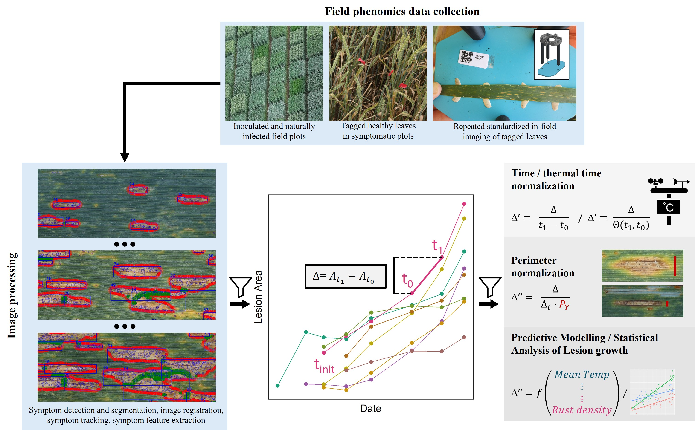

# Septoria Lesion Growth

This repository contains code to reproduce numeric results, figures, and tables reported in [todo: add link to preprint].

## Author

> Jonas Anderegg  
> Plant Pathology Group  
> ETH Zürich  

## Installation
Download the R-code as an archive or using git. Executing the scripts will first check for missing R-libraries and their dependences and install them, if needed. 

## Dependencies
The mixed model analyses in this project rely on the `ASReml-R package`, which is proprietary software and requires a valid license.

## Data
Data is available via the ETH Zürich publications and research data repository:
[todo: Add link]

## Reproducing the Analysis
To reproduce the analysis, execute the scripts in the order indicated by their numerical prefixes. Many scripts depend on outputs generated in earlier steps, so it is important to follow the sequence.

### Overview
1. `01_growth_analysis.R` includes all data pre-processing and filtering, and modelling of univariate relationships between features and lesion growth. Imports functions from `utils/analyze.R`.
2. `02_rfe.R` implements the described feature selection strategy. Imports functions from `utils/feature_selection.R`
3. `03_random_reg.R` implements the random regression approach. 
4. `04_random_reg.R` implements the reported 2-stage approach for heritability estimation.  
5. `05_reference_STB.R` implements the described analysis of reference data.  

